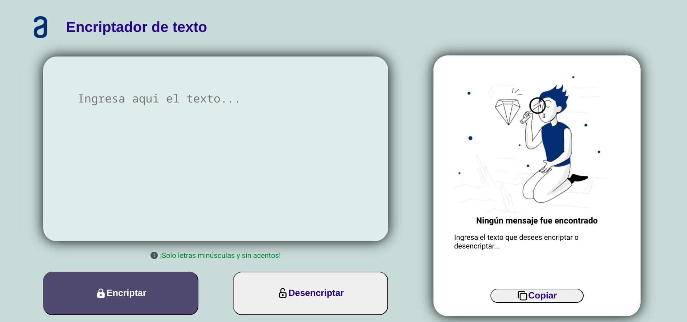
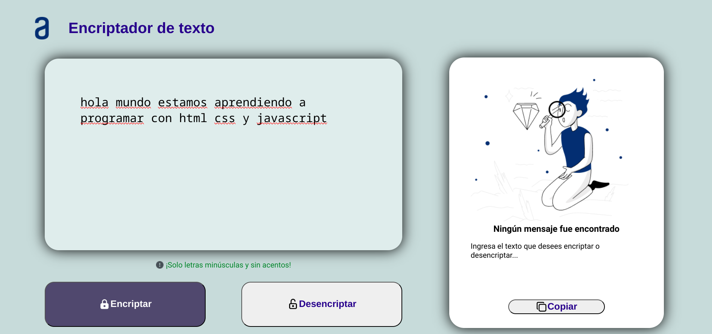
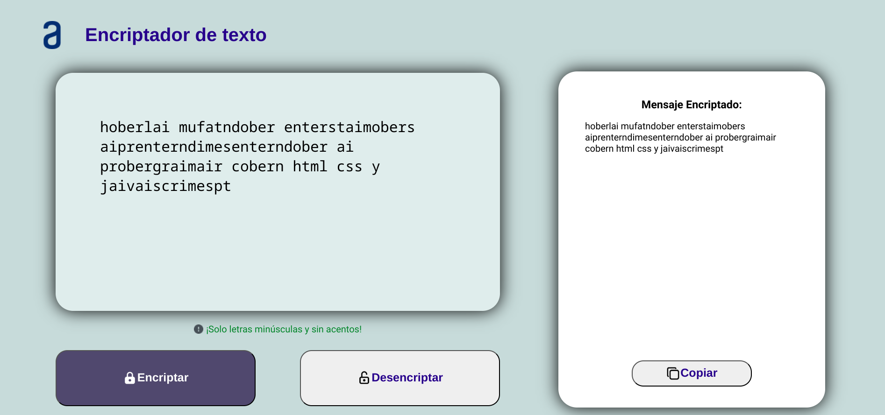
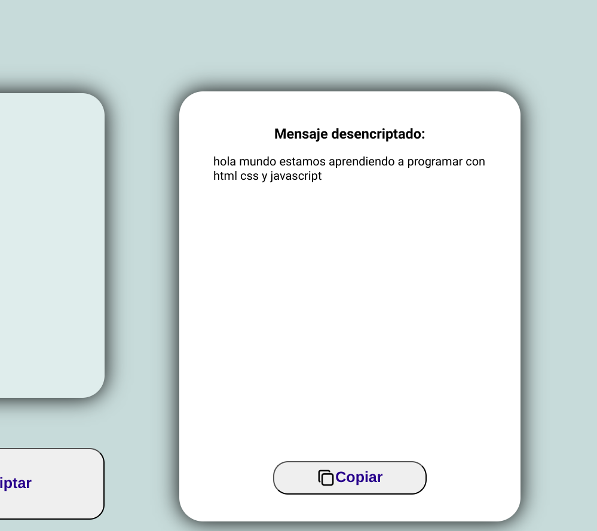
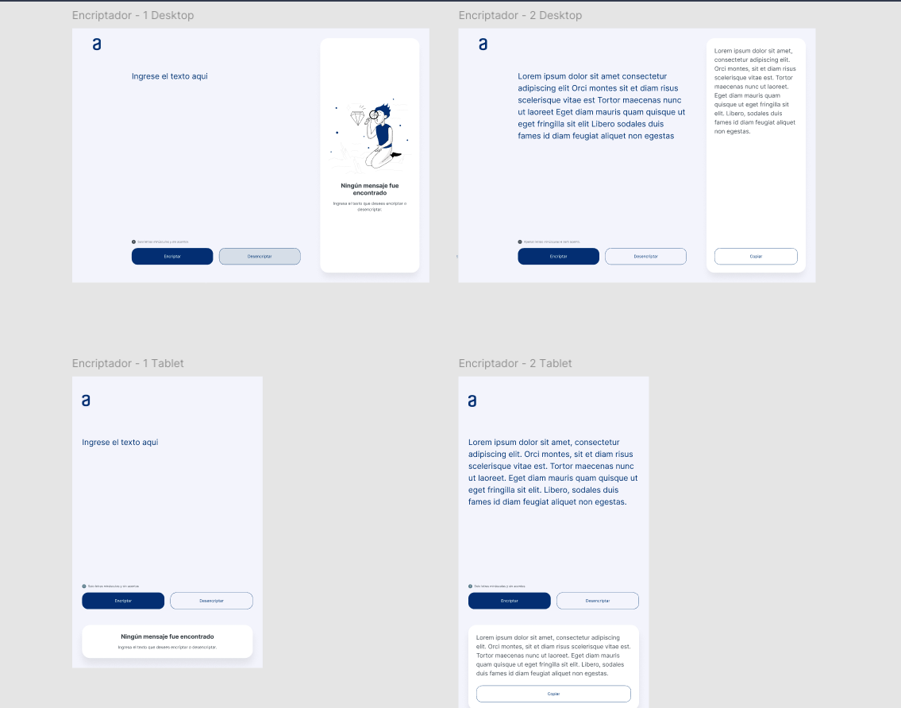
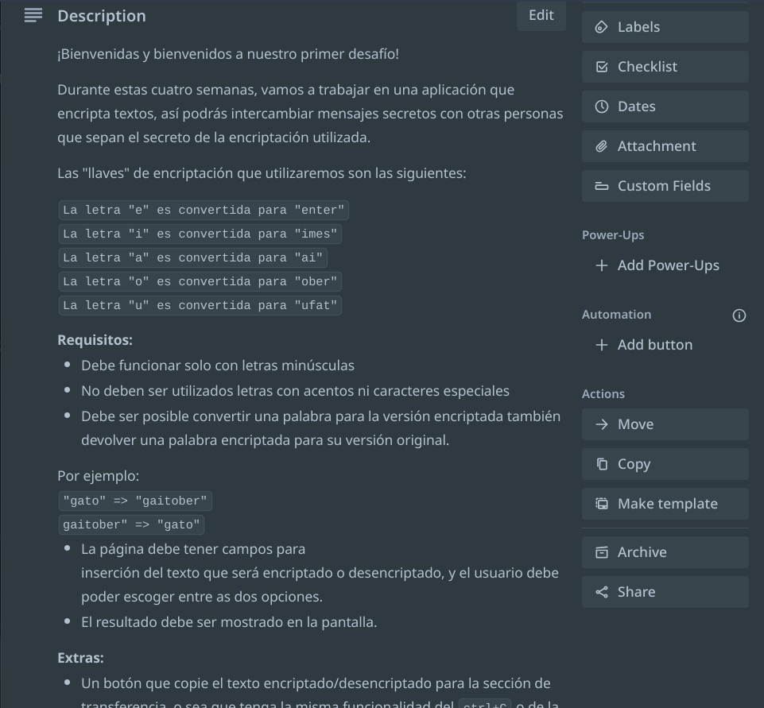
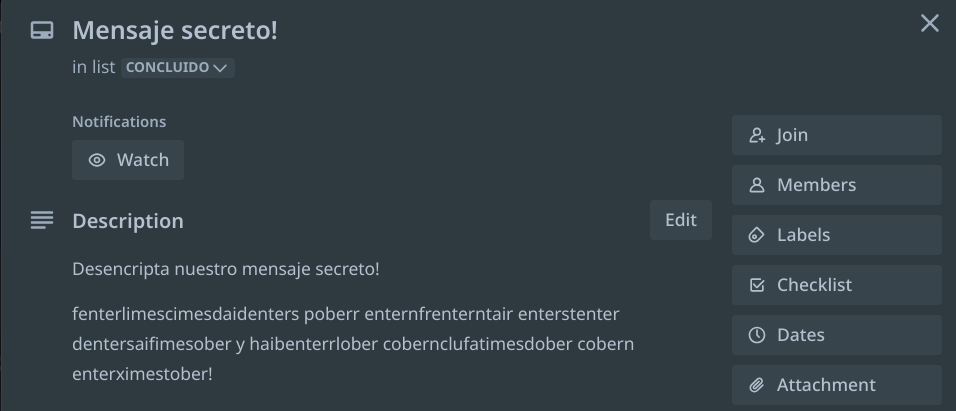
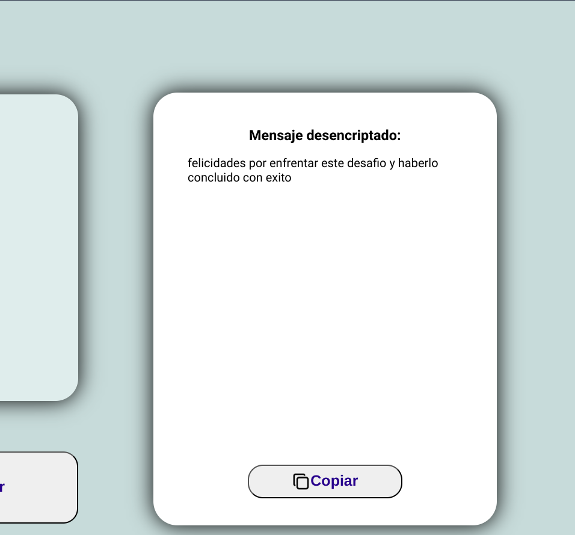

# Titulo: Encriptador  de texto Challenge ONE

Link: https://andres-bermudez.github.io/Encriptador-Texto-Challenge-ONE/

## Descripción: 
Aplicación web para encriptar y desencriptar texto, desarrollada
en HTML, CSS y JavaScript. Un encriptador de texto es una 
herramienta diseñada para convertir un texto plano en un formato
ilegible, es decir, en texto cifrado, mediante un algoritmo
criptográfico, para evitar que personas no autorizadas accedan
a la información.

- Demo de encriptación de un mensaje:

- Mensaje Encriptado:

- Mensaje desencriptado:

Este proyecto forma parte del programa de especialización en
programación del programa ONE - Oracle Next Education, donde
cada estudiante debía desarrollar una aplicación utilizando
los conocimientos adquiridos en lógica de programación con
JavaScript, así como en los cursos de frontend con HTML, CSS
y JavaScript.

Nuestros instructores nos proporcionaban los requisitos de la 
aplicación y debíamos cumplir con cada uno de ellos. Además,
quienes lo desearan podían añadir mejoras a la aplicación. En
mi caso, agregué un par de botones con algunos eventos
adicionales y los decoré con íconos para mejorar la experiencia
del usuario.

Modelos en Figma:

- Requerimientos de la aplicación:

- Reto del proyecto:

- Reto completado/mensaje descubierto:
