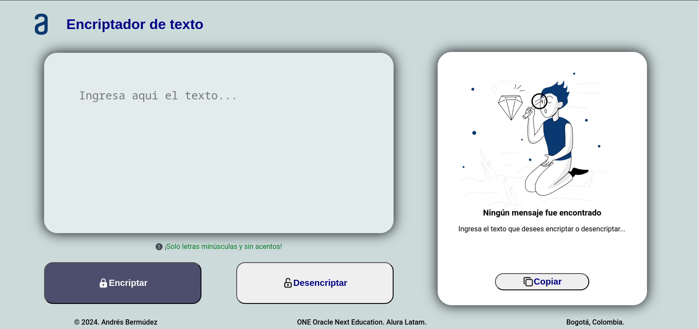

# Titulo: Encriptador  de texto

[GitHub Pages - Encriptador de Texto](https://andres-bermudez.github.io/Encriptador-de-texto/)

## Descripción: 
Aplicación web para encriptar y desencriptar texto.  
Proyecto del primer Challenge de la formación como principiante de programación,  
del programa de ONE Oracle Next Education en Alura.

## Tecnologías Utilizadas: HTML, CSS, JavaScript.

## Aplicación con adaptabilidad a diferentes dispositivos.

